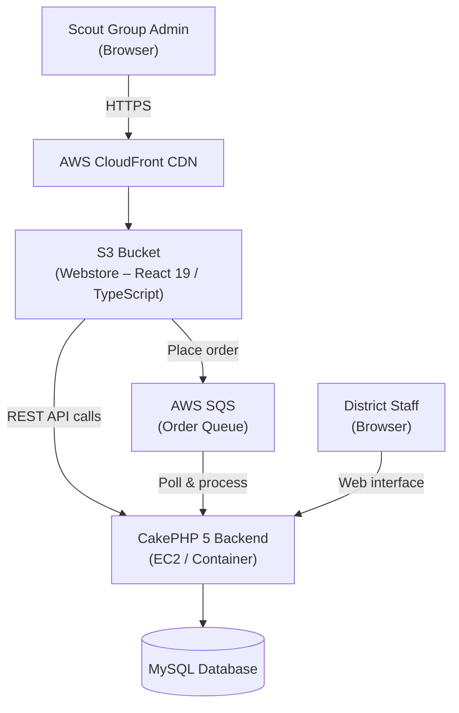

# District Badges

District Badges is a stock management and ordering system for Scout badge merchandise. Scout group administrators browse and order badges through a customer-facing webstore; district staff manage stock, fulfilment, replenishments and invoicing through a CakePHP back-office interface.

## Repository Layout

| Folder | Description | README |
|--------|-------------|--------|
| [`backend/`](backend/) | CakePHP 5 back-office application and REST API | [backend/README.md](backend/README.md) |
| [`webstore/`](webstore/) | React 19 / TypeScript customer-facing webstore | [webstore/README.md](webstore/README.md) |
| [`design/`](design/) | Bootstrap Studio UI design assets | [design/README.md](design/README.md) |
| [`postman/`](postman/) | Postman API collections and globals | – |

## System Architecture

The diagram below shows how the components fit together in production.

### How it hangs together

1. **Webstore** – A React single-page application built with Vite and served as static files from an **AWS S3** bucket via **AWS CloudFront**. Scout group administrators use it to browse badges and place orders.
2. **Order Queue** – When an order is submitted the webstore publishes a message to an **AWS SQS** queue. Using a queue decouples the storefront from the backend and makes order submission resilient to temporary backend unavailability.
3. **Backend** – A **CakePHP 5** application that provides:
   - A REST API consumed by the webstore.
   - A web interface for district staff to manage stock, process orders, raise invoices and record replenishments.
   - A consumer that polls SQS, accepts orders and performs stock management to accurately fulfil them.
4. **Database** – A **MySQL / MariaDB** database owned by the backend stores all domain data (see the [backend README](backend/README.md) for the full schema).

## Getting Started

See the README for each component:

- [Backend setup](backend/README.md#getting-started)
- [Webstore setup](webstore/README.md#getting-started)
