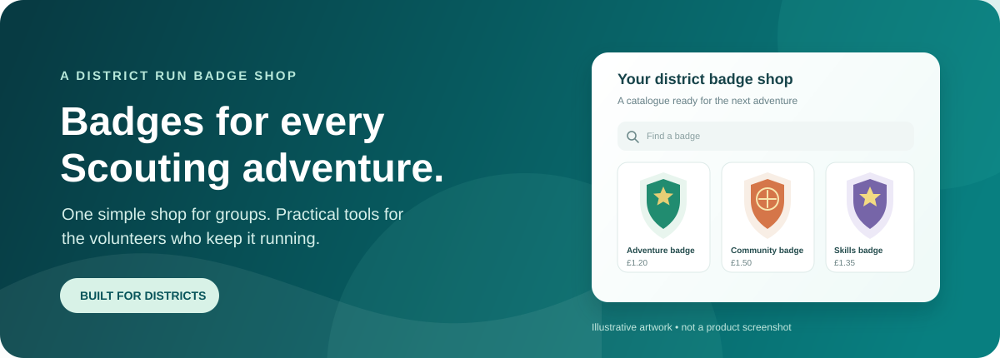
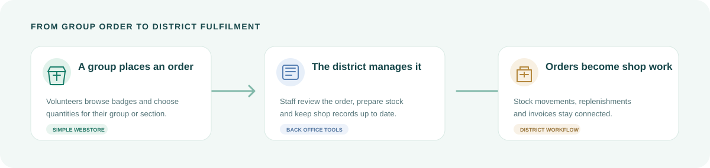
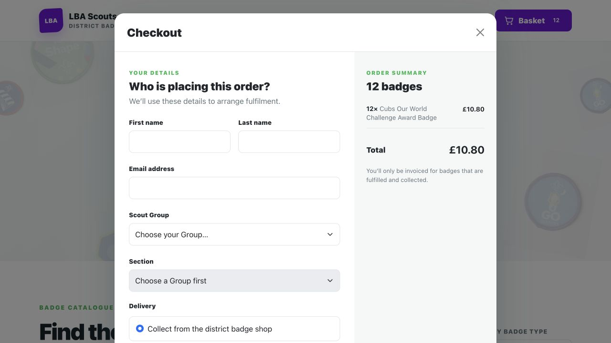

# District Badges

  

**Less badge-shop admin. More time for Scouting.**

Give Scout groups one clear place to order badges, and give district volunteers the tools to run the shop. District Badges brings the catalogue, orders, stock, fulfilment and invoicing together in a system a district can deploy in its own environment.

It is designed for volunteer-run district badge shops. Groups browse a simple webstore and submit orders; district staff use the back office to manage stock and fulfilment. The system records stock movements and supports invoicing without collecting payment at checkout.

## A practical badge shop for your district

| For Scout groups | For district teams | For your district |
| --- | --- | --- |
| Browse a searchable badge catalogue and order for a group or section. | Track stock, receive replenishments, fulfil orders and raise invoices. | Deploy the applications on district infrastructure and configure the services your operation uses. |

  

*Product illustration: the group ordering and district fulfilment journey.*

## See District Badges in action

### A welcoming shop for every section

Help volunteers find the right badges with a visual catalogue, search and filters for section and badge type. Choose quantities, review the basket and place a group order through a straightforward checkout.

### A clear view of your district stock

See quantities on hand, pending, reserved, received, fulfilled and invoiced together. Open a badge’s transaction history to follow the movements behind those figures, and use stock audits to compare the records with what is on the shelf.

### From badge orders to group invoices

District volunteers can enter orders, prepare fulfilments, manage replenishments and generate invoices for dispatched badges. Groups choose collection or postal delivery where offered, with no payment collected at checkout.

**[Take the full product tour →](docs/product-tour.md)** — 20 screenshots covering the shop and back office. For a short introduction to share with another district, see [Introducing District Badges](docs/introduction.md).

## How it works

1. A group volunteer finds the badges they need and submits an order through the webstore.
2. District staff review and fulfil orders from the back office, with stock movements recorded in a ledger.
3. The district manages replenishments and invoices groups through its existing badge-shop process.

The webstore does not take payment. It sends order details to the district backend, which remains the source of truth for products, prices and stock.

## Deploy it for your district

The backend is a CakePHP application and the webstore is a React application. The repository includes container and Kubernetes deployment resources, plus guides for running each component locally. Districts can adapt the deployment to their own infrastructure and operational needs.

The application also integrates with services for catalogue search, group and section data, order processing and email. Review the [deployment guide](docs/deployment/kubernetes.md) and [system architecture](docs/architecture.md) to understand those dependencies before planning an installation.

## Explore the project

| Start here | What you will find |
| --- | --- |
| [Deployment guide](docs/deployment/kubernetes.md) | Kubernetes deployment, configuration and operational updates |
| [System architecture](docs/architecture.md) | Application components, data flow and service dependencies |
| [Backend development guide](docs/backend-development.md) | Local setup, API, domain model and backend configuration |
| [Webstore development guide](docs/webstore-development.md) | Local setup, catalogue configuration and storefront details |
| [Design assets](design/README.md) | Bootstrap Studio source file |
| [Postman collection](postman/README.md) | Example API requests |

For a quick local development setup, start with the [backend guide](docs/backend-development.md) and [webstore guide](docs/webstore-development.md). A local setup still needs suitable catalogue and group data configuration.

## Repository layout

- [`backend/`](backend/) — district staff back office and REST API
- [`webstore/`](webstore/) — group-facing badge shop
- [`K8S/`](K8S/) — Kubernetes manifests and operational scripts
- [Documentation index](docs/README.md) — technical, development and deployment guides
- [`design/`](design/) — editable interface design source
- [`postman/`](postman/) — API collection and workspace globals
