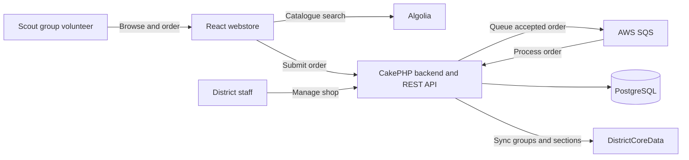

# System architecture

District Badges has two user-facing applications backed by one domain service. Scout group volunteers use the webstore to place orders. District staff use the backend to maintain the badge shop and fulfil those orders.

## Components

- **Webstore** — React and TypeScript single-page application for browsing badges and submitting group orders. It is built as static files and can be served by a web server or static hosting service.
- **Backend** — CakePHP application that provides the staff interface and REST API. It owns the catalogue records, group and section references, stock, orders, fulfilment and invoicing.
- **Database** — PostgreSQL stores application data. Stock movements are recorded in the stock transaction ledger and used to derive current stock totals.
- **Order queue** — AWS SQS separates order submission from order processing. Accepted requests are queued, then validated and processed by a backend consumer.
- **Catalogue search** — Algolia serves badge search to the webstore. The backend publishes the searchable badge data.
- **Group and section data** — DistrictCoreData supplies the canonical group and section identifiers used by the webstore and backend.
- **Email** — Backend email configuration is used for order notifications where enabled.

## Order flow

1. The webstore loads the badge catalogue from Algolia and group and section options from build-time data.
2. A group volunteer submits contact, group, section and badge quantity details to the backend API. No payment details are collected.
3. The backend accepts the request and sends it to the order queue.
4. A backend worker processes the queued order, checks it against the current records and applies the stock workflow.
5. District staff manage fulfilment, replenishments and invoices through the back-office application.

The backend is authoritative for validation, prices and stock. Group and section data must be kept aligned between the webstore build and backend sync; see the [webstore guide](webstore-development.md) and [backend guide](backend-development.md).

## Deployment considerations

The repository includes Kubernetes manifests for the backend, PostgreSQL and workers. The webstore can be built and hosted as static files. A district planning a deployment should account for the integrations above, configure environment-specific secrets, and decide how to provide its catalogue search, group data, queue, database and email services.

See the [Kubernetes deployment guide](deployment/kubernetes.md) for the included manifests and the [backend configuration reference](backend-development.md#configuration-reference) for application settings.
