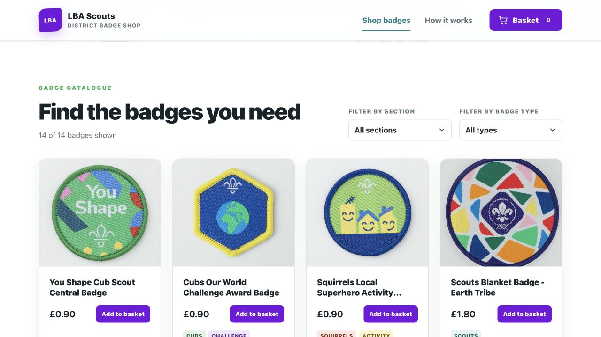
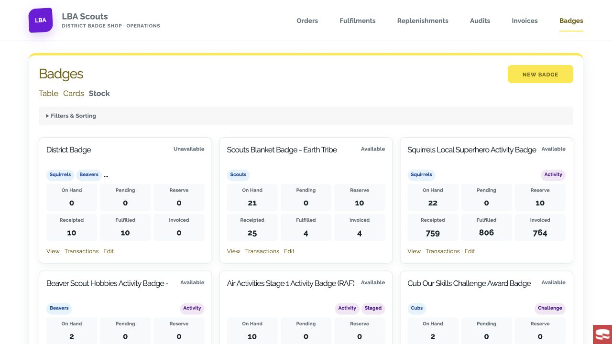

# District Badges: more time for Scouting

**A welcoming badge shop for your groups. A practical workspace for your district team.**

Every badge marks something a young person has learned, tried or achieved. District Badges helps the volunteers behind those moments organise the ordering, stock and paperwork in one place.

For group and section volunteers, it starts with a visual badge catalogue. Search for a badge, filter by section or type, choose the quantities you need and review your basket. Checkout collects the details the district needs to fulfil the order, with collection and postal delivery options where offered. There is no payment to make at checkout.

For the district badge team, the back office brings the day-to-day jobs together: customer orders, fulfilments, stock replenishment, stock counts and invoicing. See stock quantities at a glance, follow individual badge movements through the transaction ledger and compare expected stock with a physical count. Replenishment records keep ordered and received quantities visible, while invoicing works from dispatched badges.

District Badges is designed around a volunteer-run district shop. Groups get a clear ordering journey; shop volunteers get a shared place to manage the work behind it. Districts can deploy the system in their own environment, using the included development and Kubernetes guides to plan the required services and configuration.

**Give your district a badge shop that connects the catalogue, the stock cupboard and the paperwork.**

Explore the [20-screen product tour](product-tour.md), or start planning an installation with the [deployment guide](deployment/kubernetes.md) and [system architecture](architecture.md).

## Short announcement

Meet District Badges: an online badge shop and back office designed for Scout districts. Groups can browse badges, build a basket and place an order, while district volunteers manage stock, fulfilment, replenishments, audits and invoicing in one system. A simpler way to organise the work behind every badge.
