# District Badges product tour

**From finding a badge to keeping the district shop running.** This tour shows the group-facing shop and the tools district volunteers use behind the scenes.

[Project introduction](introduction.md) · [Repository README](../README.md) · [Technical documentation](README.md)

## The group ordering journey

### 1. A welcoming first impression

The shop introduces the district service with a prominent badge search and clear navigation.

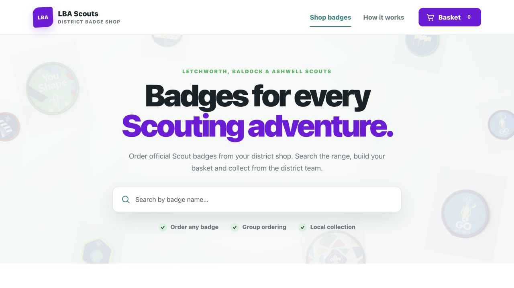

### 2. Browse the badge catalogue

Badge photographs, names and prices help volunteers find what they need. Section and badge-type filters sit above the catalogue.

### 3. Find badges for your section

Selecting Cubs narrows the catalogue to matching badges, including staged badges shared across sections.

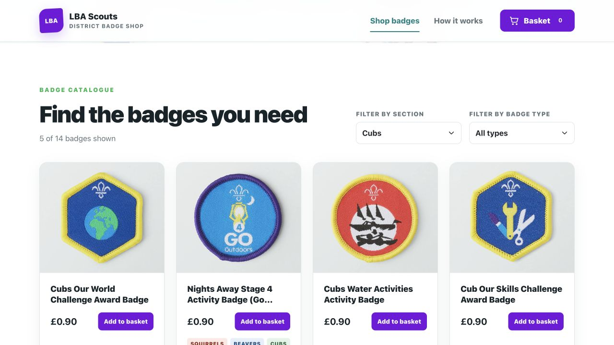

### 4. Choose the quantity you need

The quantity dialog shows the unit price and updates the line total before the badges are added to the basket.

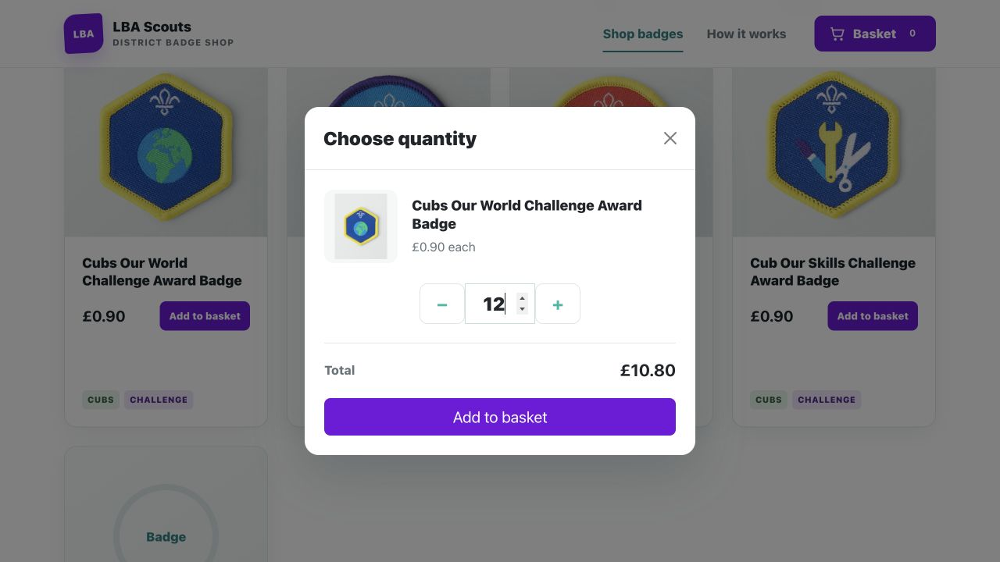

### 5. Review the basket

Volunteers can adjust quantities, remove items and check the subtotal before continuing to checkout.

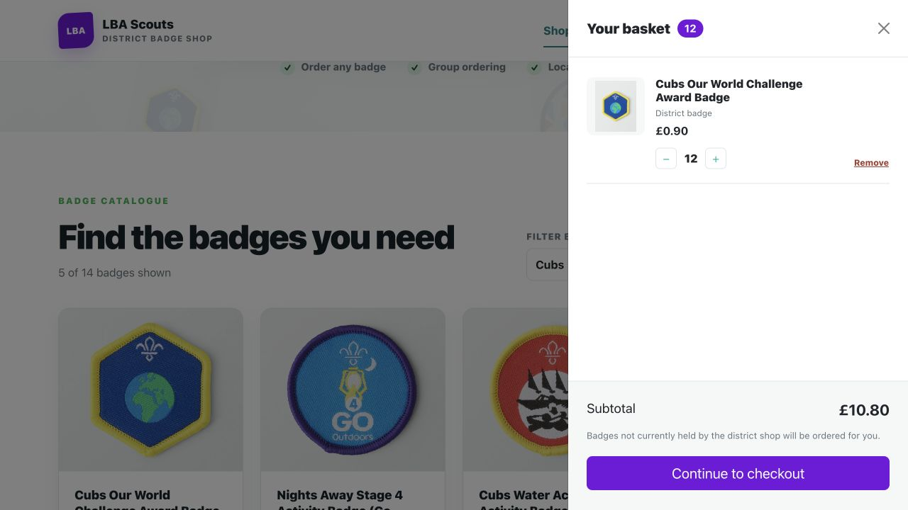

### 6. Keep group ordering straightforward

Checkout collects contact, group and section details alongside an order summary. No payment details are requested.

### 7. Choose how to receive the order

The lower checkout view shows collection and postal delivery choices, together with the final confirmation button. The amount shown is this installation’s configured postage charge.

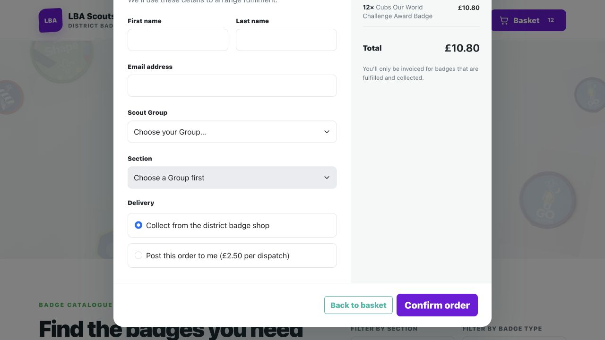

### 8. Explain the journey to volunteers

The shop explains the steps from choosing badges to collection and treasurer invoicing.

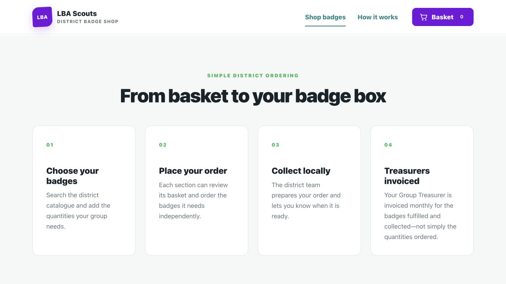

## Inside the district badge shop

### 9. One starting point for the district team

The operations home introduces the back office and highlights counts for orders, replenishments and recent fulfilments.

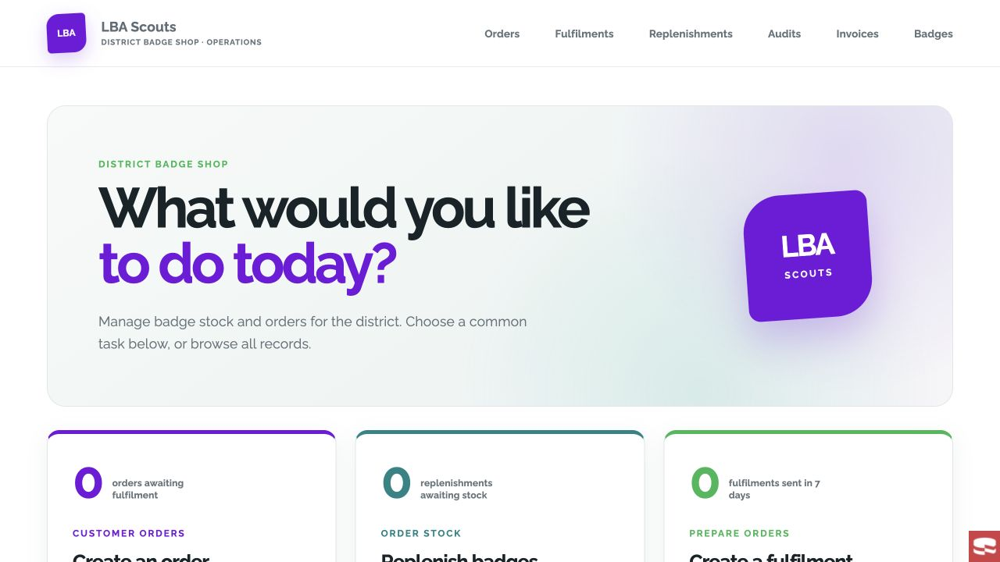

### 10. Get to everyday tasks quickly

Shortcuts lead volunteers to order creation, replenishment and fulfilment, with further links to the supporting records.

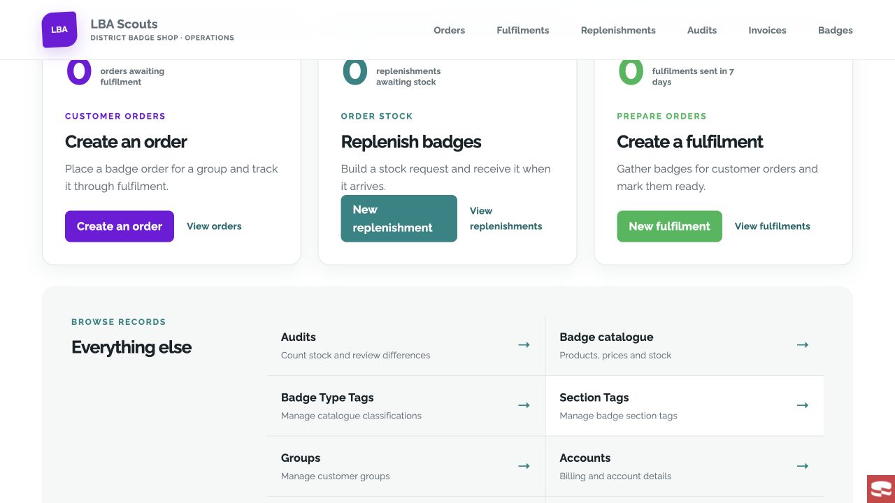

### 11. Enter orders in the back office

Staff can select an account and user, then build order lines with quantities, unit prices and line amounts. This screenshot shows an unsaved form.

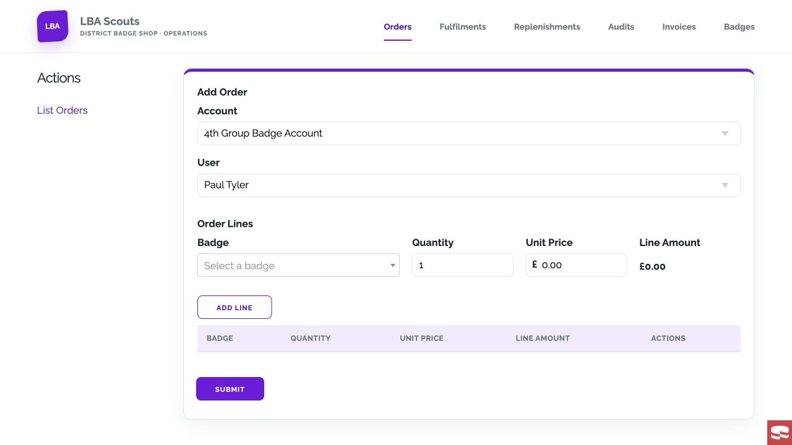

### 12. Prepare a fulfilment

The fulfilment form brings together the order selection and dispatch type. The local installation had no eligible orders when captured, so this is the empty preparation form.

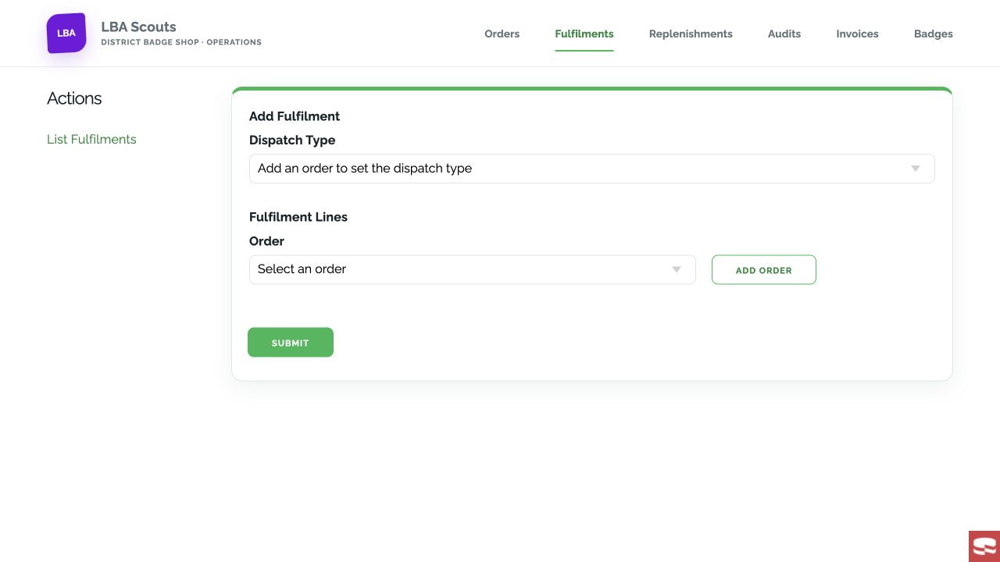

### 13. Manage the district catalogue

The table view lists badges, availability and links to details, transactions and editing.

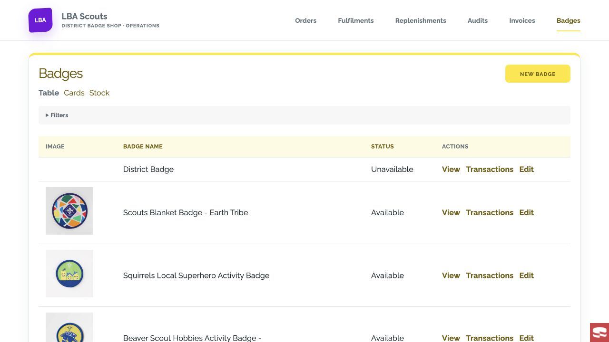

### 14. See the stock position

Stock cards show on-hand, pending, reserve, receipted, fulfilled and invoiced quantities for each badge.

### 15. Follow individual stock movements

A badge’s transaction ledger links movements to the originating replenishment or fulfilment and shows quantity changes, prices and amounts.

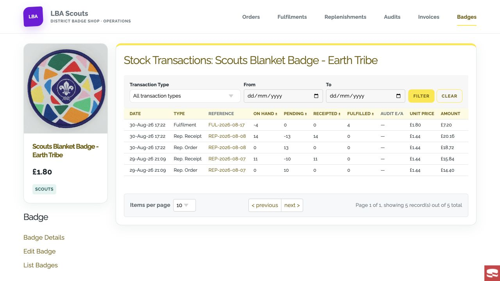

### 16. Track stock replenishment

The replenishment list brings status, ordered quantities and values, and received quantities and values into one view.

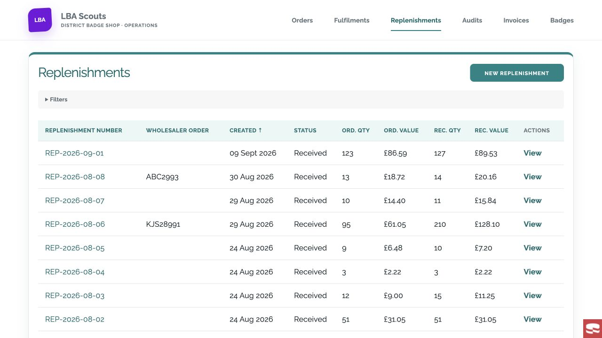

### 17. Compare the order with the receipt

A replenishment record shows its lifecycle dates and separate ordered and received totals. Badge-level lines continue below the summary.

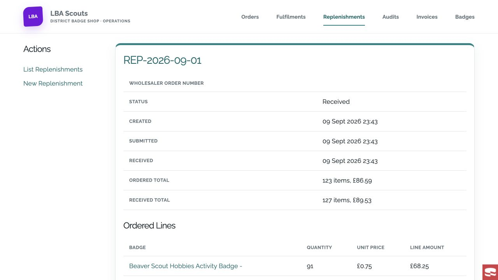

### 18. Check the shelf against the records

Completed audits compare expected and actual counts, with the differences shown for each counted badge.

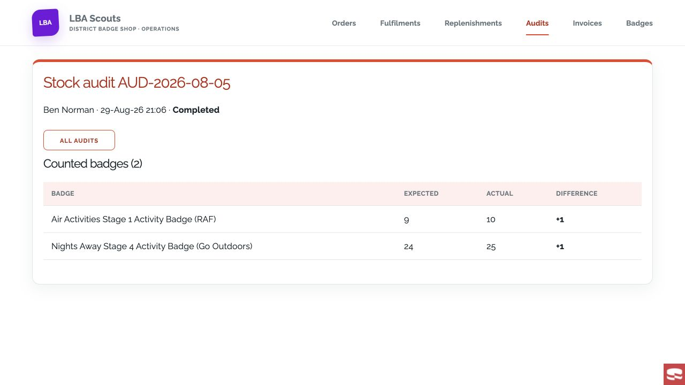

### 19. Keep group billing organised

The invoice list shows billing periods and group accounts, with controls for viewing, downloading and managing invoices.

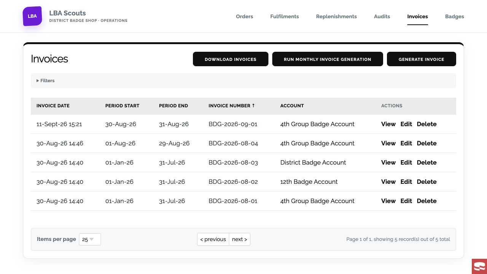

### 20. Invoice dispatched badges

Invoice generation selects an account and a fulfilment date range. The form explains that invoices include dispatched badges from completed days in that range.

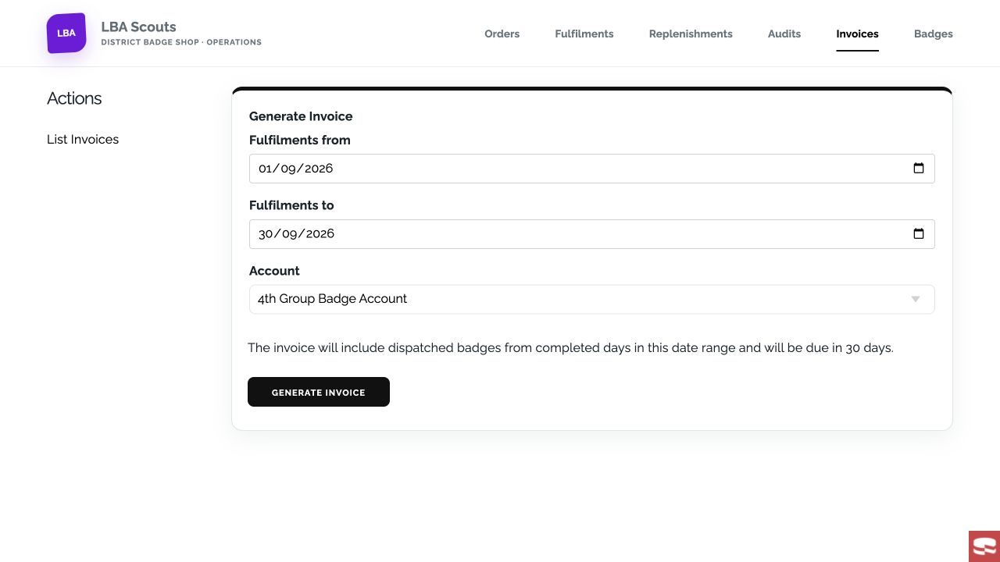

## About these screenshots

Captured on 1 October 2026 from the running local webstore (`http://localhost:5173/`) and back office (`http://localhost:8766/`), at the browser’s default 1280 × 720 viewport. They show the LBA-branded installation and its existing catalogue and operational records; prices, stock counts, dates and names are specific to that installation.

The basket was populated temporarily for the ordering screenshots and cleared afterwards. No order was submitted, fulfilment dispatched, invoice generated or stock record changed. Screenshots avoid customer contact and postal-address detail pages. Some back-office views include the local development Debug Kit icon.

The images are individual viewport captures, rather than full-page composites. All 20 original JPEGs are in [images/screenshots](images/screenshots/).
