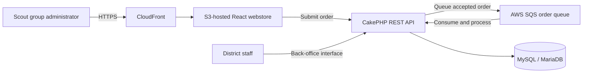

# District Badges – Webstore

> Part of the [District Badges](../README.md) system. See also: [Backend](../backend/README.md) · [Design](../design/README.md) · [Postman](../postman/README.md)

The webstore is the customer-facing front end for a UK Scouting District badge shop. The shop purchases Scouting badges wholesale from TSA (The Scout Association) and resells them to Scout groups within the district. It is built with [React 19](https://react.dev), [TypeScript](https://www.typescriptlang.org) and [Vite](https://vite.dev), and uses [React Bootstrap](https://react-bootstrap.github.io) for UI components.

Scout group and section volunteers use the webstore to browse available badges and place back-orders for their section.

## Product Context

District Badges supports the operation of a UK Scouting District badge shop. The district purchases TSA Scouting badges at wholesale and holds them as local stock for resale to its Scout groups. This gives groups a district-level storefront through which they can obtain the badges needed for their programmes.

This application is the customer-facing shop front for that service. The separate CakePHP application provides the API and the back-office tools used by district badge-shop staff to manage the wholesale stock, group orders, fulfilment, replenishment and invoicing.

The primary webstore journey is:

1. A volunteer searches or browses the district shop's catalogue of TSA Scouting badges.
2. They select the badges and quantities required by their section.
3. They provide their name, email address, group and section, then submit the order.
4. The order is queued for reliable processing by the backend.
5. District staff fulfil the order, manage stock and raise the associated invoice in the back-office application.
6. Fulfilled items are invoiced monthly directly to the relevant group Treasurer.

The backend owns the system's domain data and business processes, including the badge catalogue, wholesale replenishments, district stock, Scout group accounts, resale orders, fulfilment and invoicing. The webstore should treat API responses as the source of truth and remain focused on the Scout group ordering experience.

## System Context

In production, Vite builds this application as a static single-page application. The compiled files are hosted in an AWS S3 bucket and delivered through AWS CloudFront.



Using SQS for submitted orders decouples order intake from backend processing and allows orders to be accepted when backend processing is temporarily unavailable. The CakePHP consumer is responsible for validating and importing queued orders and applying the corresponding stock-management workflow.

For more detail on the wider system and its data model, see the [root README](../README.md) and [backend README](../backend/README.md).

## Application Responsibilities

The webstore is expected to provide:

- A responsive badge catalogue and product-browsing experience.
- A basket and order review flow.
- Order submission with clear pending, success and failure states.
- A checkout that captures the volunteer's contact details, group and section without taking payment.
- Accessible, consistent UI built with Bootstrap and React Bootstrap.

Administrative stock changes, fulfilment, replenishment and invoicing belong in the backend and are outside the scope of this application.

## Design and Styling

The district website at `~/Development/district-site` is the visual style guide for this application. The webstore should feel like part of the same district service rather than a separate, generic ecommerce site.

Use Bootstrap 5 and React Bootstrap as the foundation for layout, responsive behaviour and accessible interface components. Prefer Bootstrap's grid, spacing utilities and component patterns before adding application-specific CSS.

Shared district styling is maintained in the [DistrictStyles repository](https://github.com/LBDistrictScouts/DistrictStyles) and published through GitHub Packages as `@lbdistrictscouts/district-styles`. That package is the preferred source for shared Bootstrap configuration, design tokens, fonts, icons and reusable district components. Improvements that apply to more than this storefront should be contributed there instead of being duplicated locally.

When creating or refining the storefront UI, follow the district-site conventions:

- Use **Nunito Sans** as the primary typeface, with a suitable sans-serif fallback.
- Use the district teal (`#088486`) as the primary brand colour and preserve the site's supporting success, purple and blue palette.
- Reuse the district site's semantic colour concepts for ink, muted text, surfaces, borders and gradients rather than scattering literal colour values through components.
- Preserve the district site's rounded cards, subtle borders and shadows, generous spacing and clear typographic hierarchy.
- Support the same light and dark theme treatment where applicable.
- Keep navigation, buttons, forms and feedback states visually consistent with the district website while ensuring the purchasing flow remains clear and accessible.

The reference project is a style guide, not a source to copy wholesale. Store-specific components should use Bootstrap and React Bootstrap idioms and should keep bespoke CSS focused on district branding and interactions that Bootstrap does not already cover.

### DistrictStyles setup

Configure Yarn to resolve the `@lbdistrictscouts` scope from GitHub Packages in `.yarnrc.yml`:

```yaml
nodeLinker: node-modules

npmScopes:
  lbdistrictscouts:
    npmRegistryServer: "https://npm.pkg.github.com"
    npmAlwaysAuth: true
```

Provide a GitHub token with `read:packages` permission through `YARN_NPM_AUTH_TOKEN`, then install the package:

```bash
yarn add @lbdistrictscouts/district-styles
```

For the standard theme, import the compiled stylesheet before application-specific CSS in `src/main.tsx`:

```ts
import '@lbdistrictscouts/district-styles/css';
import './index.css';
```

The package already compiles Bootstrap into its stylesheet. React Bootstrap remains the component layer, but the webstore should not separately import Bootstrap's standard CSS when DistrictStyles is active.

If the storefront later needs to customise Bootstrap variables at build time, install Sass and use the package's `@lbdistrictscouts/district-styles/scss` entry point instead. Prefer the prebuilt CSS until such customisation is actually required.

## Requirements

| Dependency | Version |
|------------|---------|
| [Node.js](https://nodejs.org) | LTS (≥ 20) |
| [Yarn](https://yarnpkg.com)   | ≥ 1.x      |

> npm can be used in place of Yarn if preferred.

## Getting Started

### 1. Install dependencies

```bash
yarn install
```

### 2. Configure the environment

Copy `.env.example` to `.env.local` and provide the Algolia, backend API and DistrictCoreData settings described under [Catalogue and checkout configuration](#catalogue-and-checkout-configuration).

### 3. Start the development server

```bash
yarn dev
```

The application will be available at [http://localhost:5173](http://localhost:5173) (or the next available port) with Hot Module Replacement enabled.

### 4. Build for production

```bash
yarn build
```

The compiled output is written to the `dist/` directory and is ready to be served as a static site or deployed to a CDN / web server.

### 5. Preview the production build locally

```bash
yarn preview
```

## Project Structure

```
webstore/
├── scripts/
│   └── fetch-core-data.mjs # Import groups and sections before dev/build
├── public/          # Static assets copied verbatim to dist/
├── src/
│   ├── generated/   # Ignored build-time CoreData output
│   ├── assets/      # Images and other imported assets
│   ├── App.tsx      # Root application component
│   ├── App.css      # Root-level styles
│   ├── index.css    # Global CSS (resets, variables)
│   └── main.tsx     # Application entry point
├── index.html       # HTML template
├── vite.config.ts   # Vite build configuration
├── tsconfig.json    # TypeScript project references
├── tsconfig.app.json    # TypeScript config for application code
├── tsconfig.node.json   # TypeScript config for Node/Vite tooling
├── eslint.config.js     # ESLint flat config
└── package.json     # Dependencies and scripts
```

## Key Technologies

| Library | Purpose |
|---------|---------|
| [React 19](https://react.dev) | UI component framework |
| [React Router 7](https://reactrouter.com) | Client-side routing |
| [Bootstrap 5](https://getbootstrap.com) | CSS design system |
| [React Bootstrap](https://react-bootstrap.github.io) | Bootstrap components as React elements |
| [DistrictStyles](https://github.com/LBDistrictScouts/DistrictStyles) | Shared district Bootstrap theme, assets and components |
| [Vite 8](https://vite.dev) | Dev server and production bundler |
| [TypeScript 5](https://www.typescriptlang.org) | Static typing |

## Linting

Run ESLint across the project:

```bash
yarn lint
```

The project uses the TypeScript-aware ESLint flat config defined in `eslint.config.js`.

## Catalogue and checkout configuration

The backend publishes stocked badge records to an Algolia index. Copy `.env.example` to `.env.local` and configure the public catalogue search connection:

```bash
VITE_ALGOLIA_APP_ID=your_algolia_application_id
VITE_ALGOLIA_SEARCH_API_KEY=your_search_only_api_key
VITE_ALGOLIA_BADGES_INDEX=BADGES-DEV
VITE_API_BASE_URL=http://localhost:8765
VITE_POSTAGE_PRICE=2.50

CATALOGUE_API_URL=https://core-data.example.org/index.html
CATALOGUE_BASIC_AUTH_USERNAME=your_username
CATALOGUE_BASIC_AUTH_PASSWORD=your_password
```

Use a restricted, search-only Algolia API key. Never expose the admin API key configured by the backend: every variable prefixed with `VITE_` is included in client-side code.

`VITE_POSTAGE_PRICE` is a non-negative decimal amount in pounds charged per dispatch. Set it as a GitHub environment variable for each deployed environment. The checkout initially estimates one postage charge; split back orders can incur additional charges, while multiple orders may be combined into a single dispatch.

The catalogue searches the badge payload produced by `backend/src/Model/Entity/Badge.php`, including product names, prices, images, and section/type tags. Stock availability is deliberately not presented because the shop accepts back-orders.

Before `yarn dev` or `yarn build` starts Vite, `scripts/fetch-core-data.mjs` downloads `groups.json` and `sections.json` from the Basic Auth-protected DistrictCoreData endpoint. The generated data is compiled into the static application; the credentials are build-only and must never use the `VITE_` prefix. For local CoreData development, set `DISTRICT_CORE_DATA_LOCAL_PATH` to its `data/` directory.

DistrictCoreData is the canonical source of the stable group and section UUIDs. Deploy its data changes before building the webstore. The backend must sync the same version before accepting orders, otherwise a newly introduced UUID will fail checkout validation.

Checkout sends `first_name`, `last_name`, `email`, `group_id`, `section_id`, `postage`, and badge UUID/quantity lines to `POST /api/orders.json`. When postage is selected it also sends the v2 `dispatch_address` object. The backend validates the group/section relationship, calculates current prices itself and queues the order. No payment details are collected.

The latest canonical contract for both the HTTP request body and the unchanged SQS message body is [`backend/config/schema/scout-shop-order-v2.json`](../backend/config/schema/scout-shop-order-v2.json). Version 2 adds optional `postage` and `dispatch_address` properties; version 1 remains available for existing clients. Infrastructure order-ingress services must validate against the selected versioned schema before enqueueing a payload. Database-backed checks such as group/section relationships and badge existence remain the backend consumer's responsibility.

## Basket Persistence

The basket is stored in the browser's local storage under `district-badges:basket`. Checkout contact, delivery and address details are stored under `district-badges:checkout-details`. They persist across page reloads on the same browser and device and do not require an account. The basket is cleared only after checkout has been accepted by the backend.

## Available Scripts

| Command | Description |
|---------|-------------|
| `yarn dev` | Fetch CoreData, then start the Vite development server with HMR |
| `yarn build` | Fetch CoreData, type-check and build for production |
| `yarn preview` | Serve the production build locally |
| `yarn lint` | Run ESLint |
